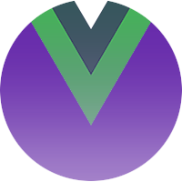

<p align="center">
  
</p>

<h1 align="center">
  <span style="color: red;">NightVue</span>
</h1>

<p align="center">
  Sleek, intuitive, and powerful front-end framework for faster and easier web development.
  <br>
  <a href="https://getbootstrap.com/docs/5.2/"><strong>Explore Bootstrap docs »</strong></a>
  <br>
  <br>
  <a href="https://github.com/twbs/bootstrap/issues/new?assignees=-&labels=bug&template=bug_report.yml">Report bug</a>
  ·
  <a href="https://github.com/twbs/bootstrap/issues/new?assignees=&labels=feature&template=feature_request.yml">Request feature</a>
  ·
  <a href="https://themes.getbootstrap.com/">Themes</a>
  ·
  <a href="https://blog.getbootstrap.com/">Blog</a>
</p>

# How to use it?

Clone repo and install dependencies
```
git clone git@git.musqogee.com:BC/frontend/bcm-app.git
npm i
```
Run hot-reload dev server
```
npm run serve
```
Build your project
```
npm run build
```
Test errors
```
npm run lint
npm run lint --fix
```

# Documentation

