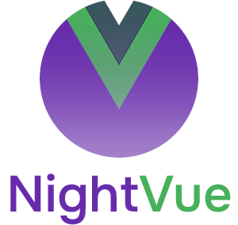

<p align="center">
  
</p>

# Introduction

### What is NightVue?

NightVue is a development framework for [Vue.js 2.x](https://ru.vuejs.org/v2/guide/). Its main feature is the absence of popular integrated components (buttons, forms, cards, dropdowns, modal windows, etc.) and the minimum number of preset styles. While many other frameworks offer ready-to-use UI solutions, NightVue gives you the maximum freedom to develop your own web interfaces. In fact, it is a set of useful tools for developers who like to do everything themselves.

The ideological basis of the framework is the most useful utilities from [Bootstrap 4.x](https://getbootstrap.com/docs/4.6/getting-started/introduction/)
, many of which have been improved. NightVue uses best practices from [Material Design 2](https://material.io/) throughout. The framework is powered by [Vue CLI 4.x](https://cli.vuejs.org/), one of the most convenient tools for developing with Vue.js.

### Who is it for?
For Front-end developers who don't like rewriting the built-in styling solutions of third-party frameworks and plugins. Those who prefer to develop "from scratch". NightVue provides much more freedom to write your own code than many other similar frameworks, as you will soon see.

### Who won't it suit?
Front-end developers who need a base of ready-made UI solutions to quickly start developing typed web interfaces. Or those who are used to this approach. In this case, our recommendation would be to use popular solutions like [BootstrapVue](https://bootstrap-vue.org/), [Vuetify](https://vuetifyjs.com/en/), [Vue Material](https://www.creative-tim.com/vuematerial/), or whatever you like. In any case, we advise you to go over the detailed documentation prepared to get acquainted with the functionality of our framework.

# Getting Started

Clone repo and install dependencies
```
git clone https://github.com/nightrunner91/nightvue.git
npm i
```
Run hot-reload dev server
```
npm run serve
```
Build your project
```
npm run build
```
Test and/or fix errors
```
npm run lint
npm run lint --fix
```

# Documentation

* [Colors](#colors)
* [Gradients](#gradients)

## Colors

Working with colors in NightVue will be familiar to a Booststrap user. In general, the systems are similar, but there are small differences that an experienced developer will surely determine on their own. The `$colors` map located in the `_varaibles.scss` file has 12 standard colors. Based on them, you can customize the colors of the theme, which will be discussed later.
```
$colors: (
  'red':       #F44336,
  'pink':      #EC407A,
  'orange':    #FF9800,
  'yellow':    #FFEE58,
  'green':     #47b05b,
  'brown':     #795548,
  'teal':      #009688,
  'cyan':      #00BCD4,
  'blue':      #2196F3,
  'purple':    #682CAB
);
```